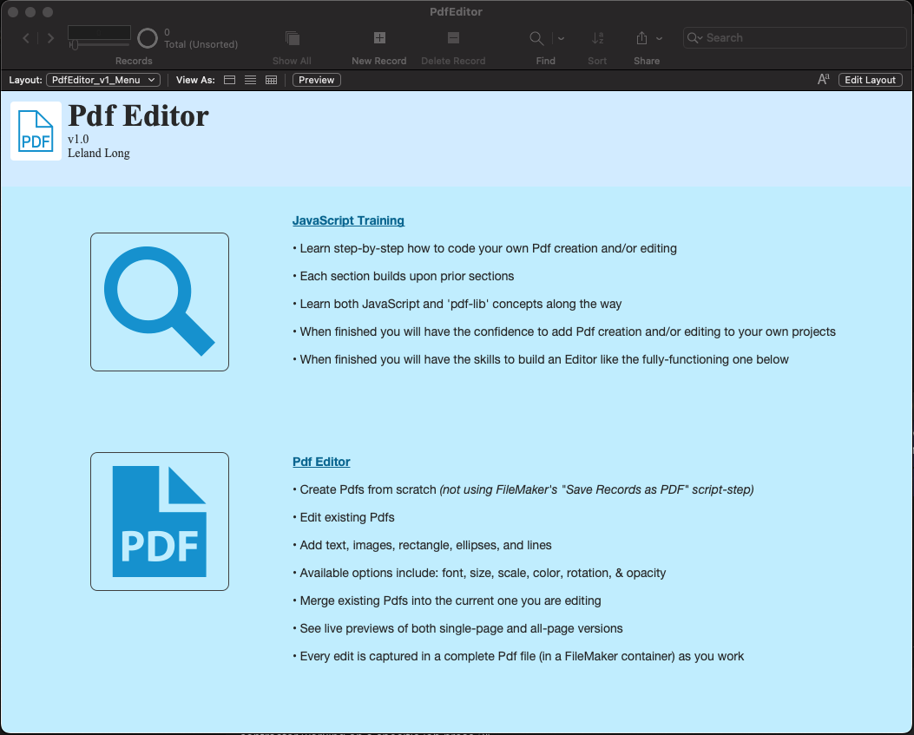
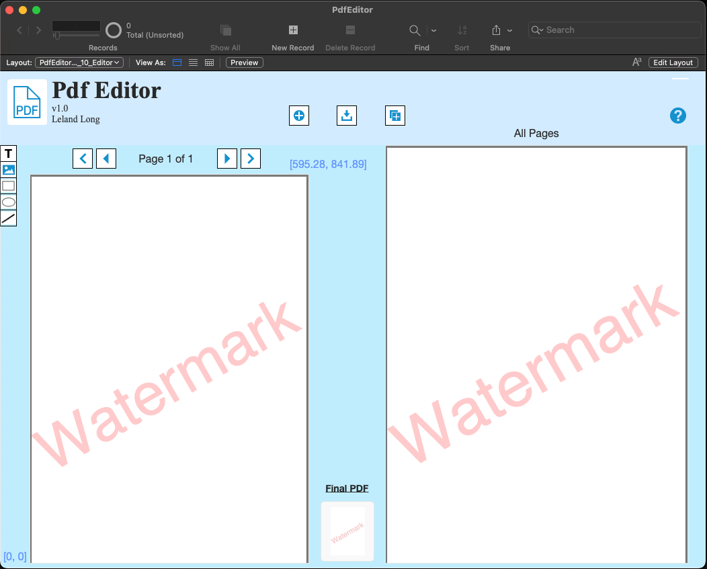

# PDFEditor

#### A FileMaker Pro utility & JavaScript integration training aid

Create or edit PDF's in FileMaker Pro, without plugins. Pure JavaScript with locally stored library 'pdf-lib'.

#### Usage

1. Download and open the zipped Filemaker Pro database

2. At the main menu, click on either of large icon buttons: one button for heading straight to the fully-functioning PDF editor and one button to begin learning how to build one yourself

3. In the PDF editor click on the '?' button for instructions on where to begin

4. In the training sections, follow the onscreen instructions (on the right):
  * Applicable scripts will be noted
  * scripts that contain JavaScript variables/code will also include comments that will help to explain what is being done
  * helpful resource links are mentioned in script comments
  * after finishing one section, move to the next one in the Layouts drop-down menu

#### Dependancies

This database uses the JavaScript Library "pdf-lib" (https://pdf-lib.js.org)

This database is completely self contained and all the required JavaScript Library data has been stored locally in the database.
